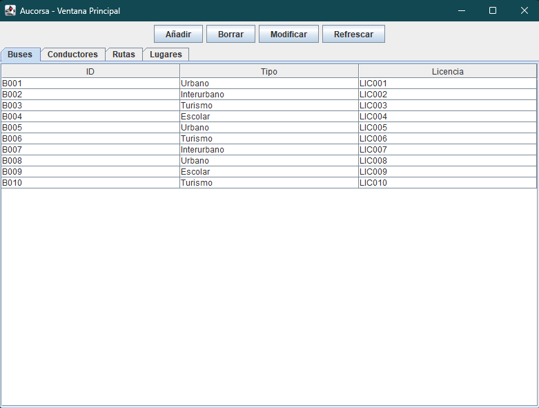
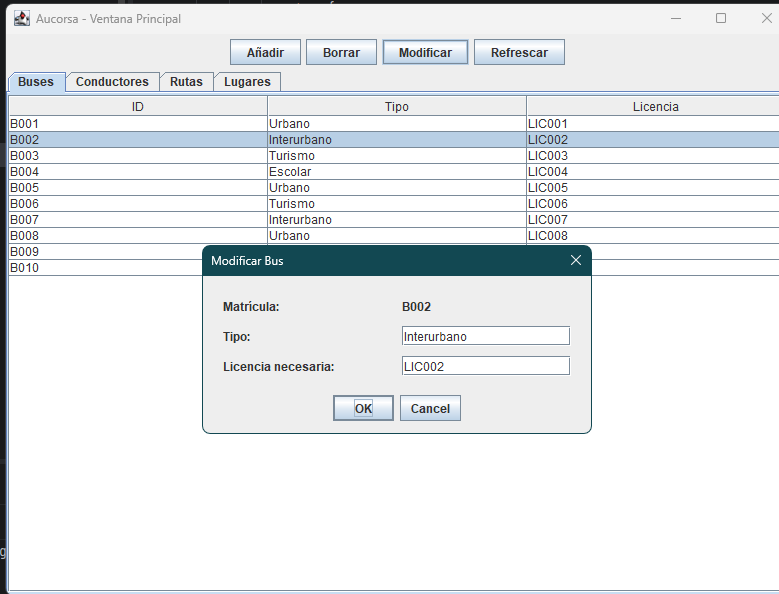
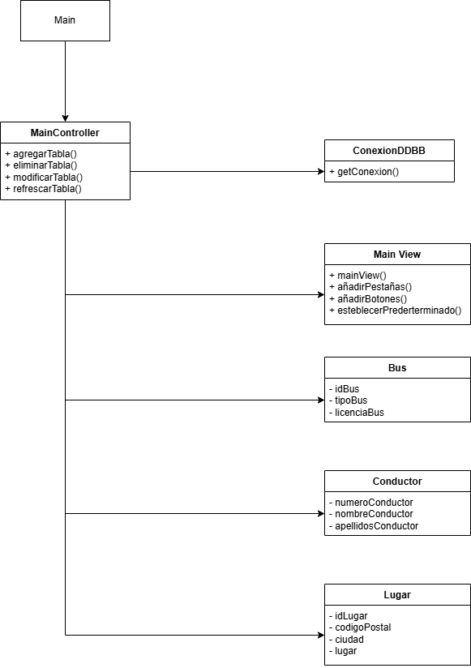

# Mi Proyecto Aucorsa

Aplicación de escritorio desarrollada en Java que permite gestionar información relacionada con autobuses, conductores y rutas de Aucorsa mediante una interfaz gráfica basada en Swing.

## Tecnologías utilizadas

- Java 17
- Swing
- Maven
- MySQL
- Git

# Funcionalidades principales

- Gestión de autobuses
- Gestión de conductores
- Gestión de rutas
- Visualización de detalles
- Conexión a base de datos MySQL

## Requisitos

* MySQL WorkBench 8.0 CE
* Un Entorno de Desarrollo ya sea Eclipse o IntelliJ
* XAMMP Control Panel
* JDK 17 o superior
* Git

## Instalación y ejecución

## Base de datos

La aplicación utiliza MySQL para almacenar la información.

## Tablas principales

- buses
- conductores
- rutas
- lugares

### 1. Clonar repositorio

```bash
git clone https://github.com/usuario/aucorsa.git
```

### 2. Abrir proyecto en IntelliJ o Eclipse

Importar el proyecto como proyecto Maven.

### 3. Configurar la base de datos

Crear una base de datos llamada:

```sql
aucorsa
```

Importar el archivo:

```plaintext
database/aucorsa.sql
```

### 4. Configurar conexión MySQL

Editar los parámetros de conexión en:

```plaintext
controller/connection/ConexionBBDD.java
```

Modificar según los parámetros que tengas:

```java
String url = "jdbc:mysql://localhost:3306/aucorsa";
String usuario = "root";
String password = "";
```

### 5. Ejecutar aplicación

Ejecutar la clase:

```plaintext
Main.java
```

# Arquitectura del Proyecto

La aplicación sigue una arquitectura MVC (Model View Controller) para separar responsabilidades y facilitar el mantenimiento.

## Estructura de carpetas

| Carpeta | Función |
|---|---|
| app | Punto de entrada de la aplicación |
| controller | Controladores y lógica de interacción |
| models | Entidades y lógica de datos |
| view | Interfaces gráficas Swing |
| utils | Métodos auxiliares |
| resources | Recursos estáticos |
| test | Pruebas unitarias |

## Explicación MVC

### Model

Gestiona los datos y entidades de negocio:

- Bus
- Conductor
- Lugar

### View

Gestiona todas las ventanas y componentes gráficos.

### Controller

Gestiona eventos, acciones del usuario y comunicación entre vista y modelo.

# Escalabilidad y mantenimiento

La arquitectura MVC facilita la ampliación del sistema separando la lógica de negocio, la interfaz gráfica y el acceso a datos.

## Añadir nuevas funcionalidades

Para añadir nuevas funcionalidades se recomienda:

1. Crear el modelo correspondiente.
2. Crear la vista Swing asociada.
3. Implementar el controlador.
4. Añadir conexión con la base de datos si es necesario.

## Tests

Las pruebas unitarias se encuentran en:

```plaintext
src/test
```

Pueden ejecutarse mediante Maven:

```bash
mvn test
```

# Capturas de pantalla

## Pantalla principal



## Gestión de autobuses



# Diagrama UML

El siguiente diagrama representa la arquitectura principal del sistema.


